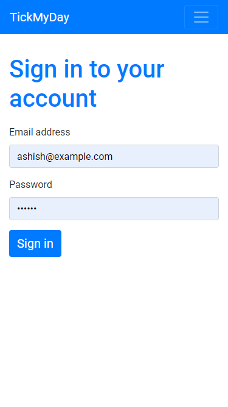

# tickmyday-java-ee-todolists-web-app
 A simple todo lists web app built using java EE

## Java EE technologies used
* Servlets
* JSP
* JSTL
* JDBC

## Other technologies used
* Bootstrap
* Fetch API (for AJAX calls with no body)
* MySql database

### Screens

##### Note: This app is 100% responsive thanks to bootstrap and some of my CSS

* Mobile screens:

## TODOs:

* Sanitize user input
* Update readme with dependency information (I have not used maven)

> I will upload PC screenshots some time later

